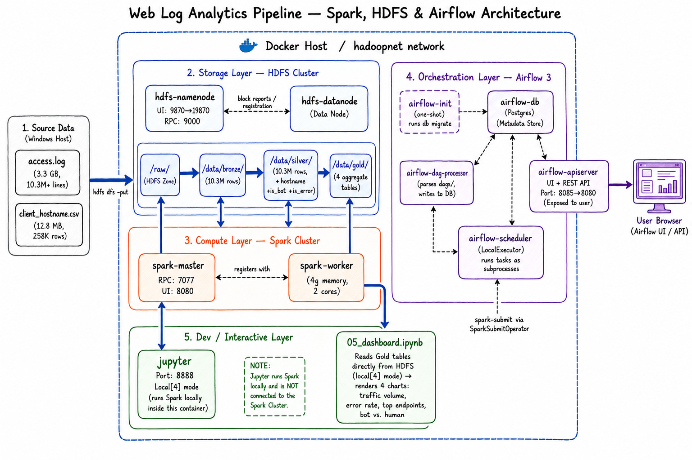
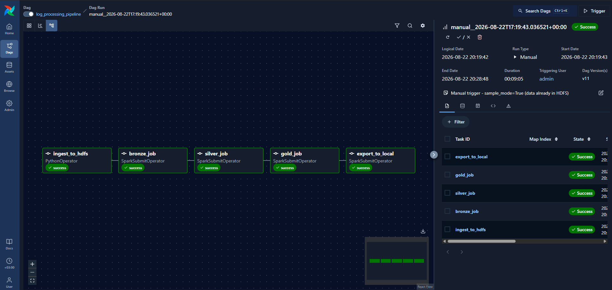
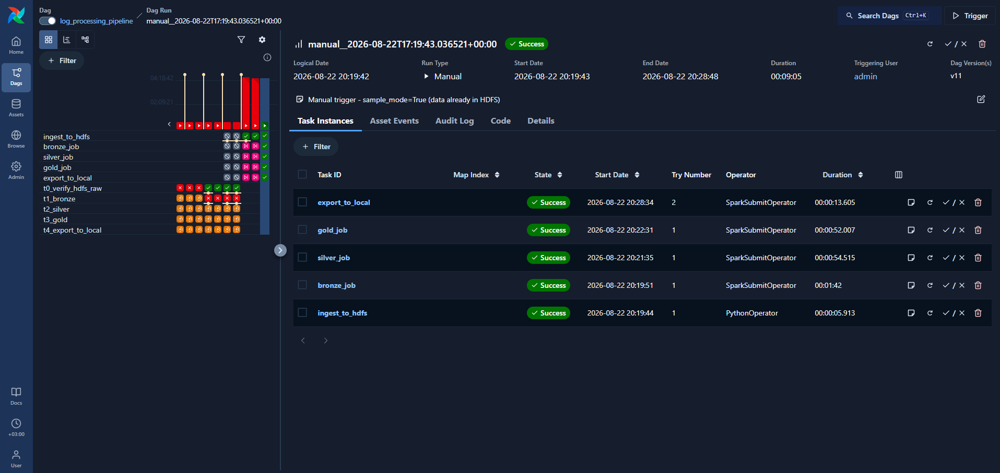
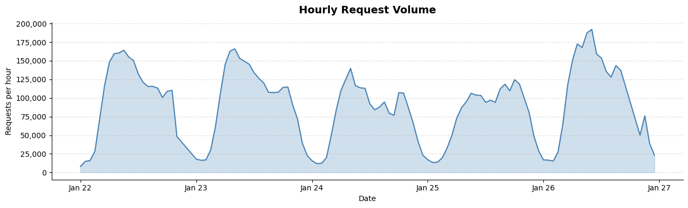
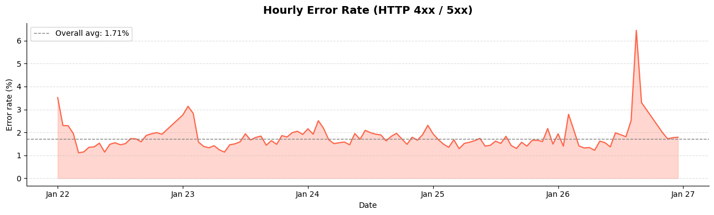
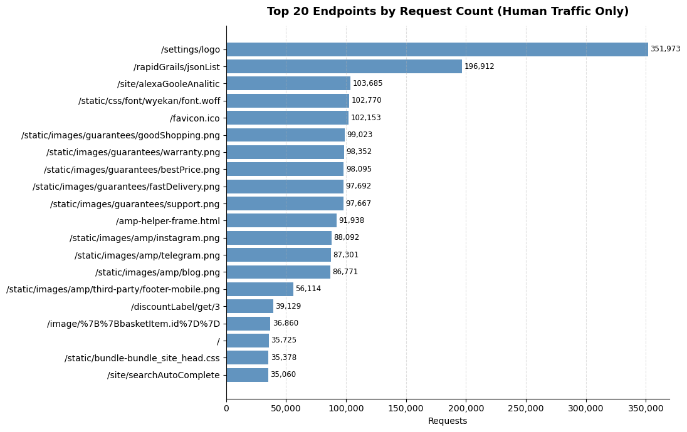
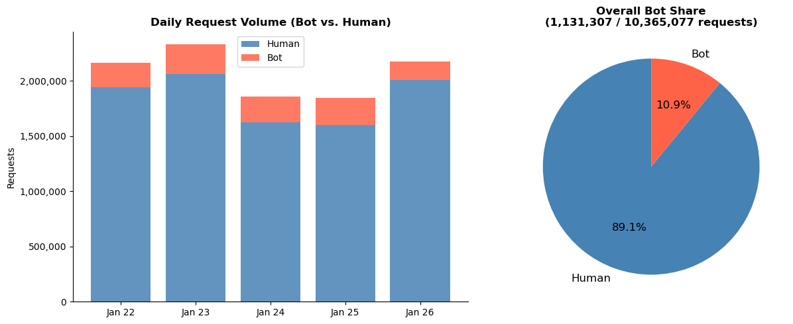

# Web Log Analytics Pipeline — Spark, HDFS & Airflow

A fully containerised batch analytics pipeline that processes 3.3 GB / 10.3 M+ Nginx access log lines from zanbil.ir (an e-commerce site) through a Bronze → Silver → Gold medallion architecture on HDFS, orchestrated by Apache Airflow.

**Dataset:** [Web Server Access Logs — Kaggle](https://www.kaggle.com/datasets/eliasdabbas/web-server-access-logs) (`access.log` + `client_hostname.csv`, ~3.3 GB). Raw data files are not committed to this repo — see [Data](#data) below.

---

## Architecture



Raw log files are uploaded from the host into HDFS, then processed through three Spark stages — Bronze (raw parse → Parquet), Silver (enrichment + classification), Gold (business aggregations) — before the results are rendered in a Jupyter dashboard notebook reading directly from the Gold tables.

---

## Tech Stack

| Component | Version |
|---|---|
| HDFS (NameNode + DataNode) | Hadoop 3.2.1 |
| Apache Spark | 3.5.6 |
| Apache Airflow | 3.3.1 (SimpleAuthManager) |
| PostgreSQL (Airflow metadata) | 13 |
| Jupyter | pyspark-notebook:spark-3.5.0 |
| Runtime | Docker Compose (8 services) |

---

## Pipeline Stages

### 🥉 Bronze — Raw Parse
[`spark-apps/01_bronze.py`](spark-apps/01_bronze.py)

Reads the 3.3 GB raw Nginx combined-log text from HDFS, applies a validated regex (99.999% match rate on 10.3 M lines; 75 unparseable BitTorrent payloads dropped), casts `status → INT` and `bytes → LONG`, and writes Snappy Parquet partitioned by `log_date`.

- **Output:** `hdfs:///data/bronze/access_logs/` — **10,365,077 rows**, 5 date partitions

### 🥈 Silver — Clean & Enrich
[`spark-apps/02_silver.py`](spark-apps/02_silver.py)

Parses the raw timestamp string to `TimestampType`, extracts `hour`, broadcast-joins a 258,445-row IP → hostname dimension (12.8 MB), flags automated traffic via user-agent keyword matching, and marks HTTP errors (`status ≥ 400`). No rows are dropped.

- **Output:** `hdfs:///data/silver/access_logs/` — **10,365,077 rows** | 10.9% bot | 1.7% error

### 🥇 Gold — Aggregate
[`spark-apps/03_gold.py`](spark-apps/03_gold.py)

Caches Silver and produces four business-level tables in a single pass:

| Table | Rows | Description |
|---|---|---|
| `traffic_by_hour` | 228 | Requests + bytes per day / hour / bot-human split |
| `top_pages` | 50 | Top endpoints by human request count (query strings stripped) |
| `error_rates` | 114 | Error count + rate per day / hour |
| `bot_vs_human` | 5 | Daily bot share + unique human IPs |

---

## Orchestration





The pipeline runs as a single Airflow DAG (`log_processing_pipeline`, `@daily`, `catchup=False`). Tasks execute strictly sequentially — each stage can only start once the previous one succeeds:

```
ingest_to_hdfs → bronze_job → silver_job → gold_job → export_to_local
```

`ingest_to_hdfs` uses a `PythonOperator` calling the WebHDFS REST API to verify raw data in HDFS (the Airflow containers have only pip-installed PySpark — no Hadoop CLI). The four Spark tasks use `SparkSubmitOperator` with `conn_id=spark_default` (`spark://spark-master:7077`). Both screenshots above are from a confirmed successful end-to-end run.

---

## Results — Analytics Dashboard

All charts below are from [`notebooks/05_dashboard.ipynb`](notebooks/05_dashboard.ipynb), reading live from the Gold HDFS tables.

### Traffic Volume Over Time


Hourly request volume across 5 days (2019-01-22 → 2019-01-26). Total: **10,365,077 requests**. Clear daily cycle visible — daytime peaks, sharp overnight trough — consistent across all 5 days.

### Error Rate by Hour


Hourly HTTP 4xx/5xx error rate. Overall average: **1.71%** (177,634 error requests). Rate varies from ~1.1% during peak daytime hours to ~3.5% in the early morning when low absolute traffic amplifies individual error clusters.

### Top 20 Requested Endpoints (Human Traffic Only)


Bot traffic excluded. Query strings stripped for clean grouping. Top endpoint: **`/settings/logo` with 351,973 requests** (site logo loaded on every page view). Second: `/rapidGrails/jsonList` at 196,912 requests from just 59 unique IPs — a scraper pattern.

### Bot vs. Human Traffic


Bot detection: user-agent keyword match (`bot`, `spider`, `crawl`, `ahref`, `python-requests`, `bingpreview`, `slurp`, `semrush`, `dataprovider`, `zgrab`) derived from a frequency analysis of the top-30 UAs. Bot share ranged from **7.68% (Jan 26) to 13.2% (Jan 25)** across the 5 days, averaging **10.9%** overall (1,131,307 bot requests).

---

## Project Structure

```
.
├── spark-apps/
│   ├── 00_ingest_to_hdfs.py      # Upload raw files to HDFS raw zone
│   ├── 01_bronze.py              # Raw parse → Parquet (Bronze)
│   ├── 02_silver.py              # Clean, enrich, classify (Silver)
│   ├── 03_gold.py                # Business aggregations (Gold)
│   ├── 04_export_to_local.py     # Export Gold → ./output/ (local Parquet)
│   └── verify_data.py            # Read-only integrity check (all layers)
├── dags/
│   └── log_processing_dag.py     # Airflow DAG definition
├── notebooks/
│   ├── 01_data_exploration.ipynb # Phase 1: regex validation, UA analysis
│   ├── 02_bronze.ipynb           # Interactive Bronze development
│   ├── 03_silver.ipynb           # Interactive Silver development
│   ├── 04_gold.ipynb             # Interactive Gold development
│   └── 05_dashboard.ipynb        # Results dashboard (4 charts)
├── docs/
│   └── *.png                     # Architecture diagram + dashboard charts
├── hadoop-config/
│   └── core-site.xml             # HDFS client config (fs.defaultFS)
├── docker-compose.yml            # 8-service stack definition
└── Dockerfile.airflow             # Airflow image with JRE + PySpark
```

---

## Data

The raw source files (`access.log`, `client_hostname.csv` — ~3.3 GB combined) are **not pushed to this repo**. Download them from the [Kaggle dataset](https://www.kaggle.com/datasets/eliasdabbas/web-server-access-logs) and place them locally per the Quick Start instructions below; they're excluded via `.gitignore`.

The small **Gold-layer Parquet output** (the aggregated tables backing the dashboard — a few hundred rows total, not the raw log) *is* committed, so the dashboard notebook can be reviewed without re-running the full pipeline.

---

## Quick Start

**Prerequisites:** Docker Desktop (WSL2 backend on Windows), ≥12 GB RAM allocated to Docker. Place `access.log` (3.3 GB) and `client_hostname.csv` in `./spark-apps/`.

```bash
# 1. Start all 8 services
docker compose up -d
docker compose ps        # wait until all services are healthy

# 2. Get the auto-generated Airflow password
docker logs airflow-apiserver 2>&1 | grep "Password for user"

# 3. Open Airflow UI → http://localhost:8085
#    (user: admin, password from step 2)

# 4. Trigger the DAG (or use the UI)
docker cp trigger_dag.py airflow-apiserver:/tmp/trigger_dag.py
docker exec airflow-apiserver python3 /tmp/trigger_dag.py

# 5. Monitor progress
docker cp check_dag_status.py airflow-apiserver:/tmp/check_dag_status.py
docker exec airflow-apiserver python3 /tmp/check_dag_status.py

# 6. View the results dashboard
#    Open notebooks/05_dashboard.ipynb at http://localhost:8888
```

**Other useful ports:**
- HDFS NameNode UI: http://localhost:19870 *(remapped from 9870 — Hyper-V exclusion)*
- Spark Master UI: http://localhost:8080
- Jupyter: http://localhost:8888